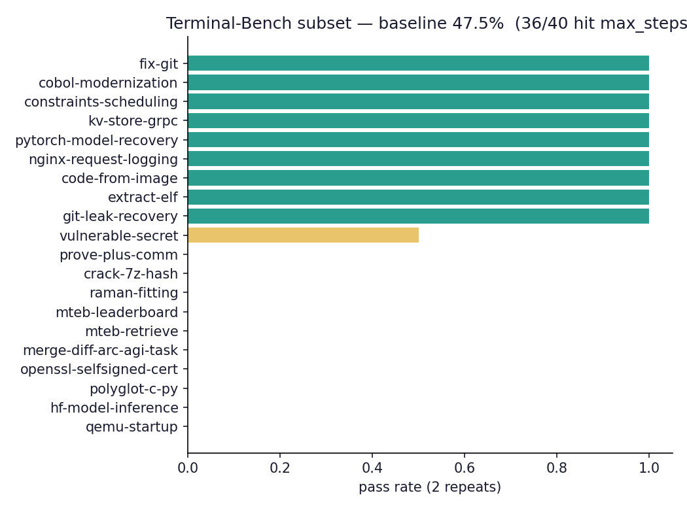
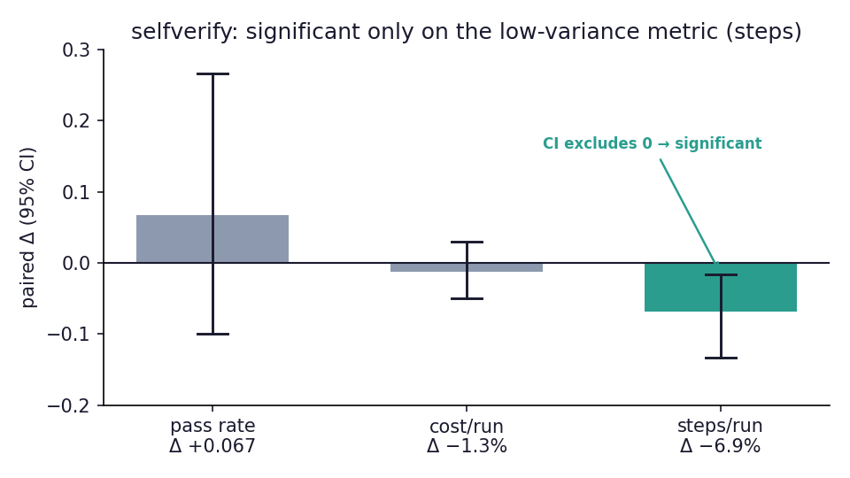
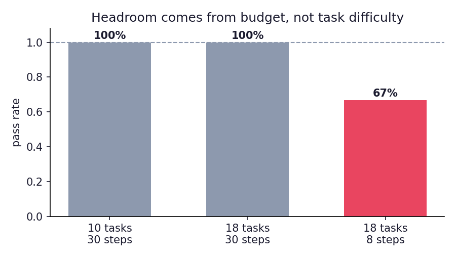

# HarnessForge

**A self-evolving coding-agent harness lab.** It runs an LLM agent against coding
tasks, mines failure patterns from execution traces, proposes *harness-level* changes
with predicted effects, and merges them only after a noise-aware regression gate —
then measures whether the change actually helped on an external benchmark.

Built to practice [harness engineering](https://martinfowler.com/articles/harness-engineering.html):
making non-deterministic agent systems reliable through constraints, observability,
and feedback loops — not prompt tricks.


---

## Results at a glance

**Terminal-Bench 2.0 subset** (20 pinned tasks, run in each task's real Docker image,
verified by TB's own reward check). Agent under test: `claude-haiku-4-5`. 25-step budget.

| | Pass rate | Notes |
|---|---|---|
| Baseline | **47.5%** (19/40, 2 repeats) | 36/40 runs exhausted the step budget without calling `finish` |



**The headline isn't a number — it's a method.** Every proposed harness change is
measured, and the ones that turn out to be noise are rejected, including changes an
earlier, weaker gate had already accepted. Two worked examples:

| Intervention (increasingly well-designed) | Looked like | Held up under rigorous measurement? |
|---|---|---|
| *native round 1:* "reverify immediately after each patch" | small-sample validation: **+100%** on targeted tasks | ❌ controlled A/B: **≈0** — was noise the gate merged |
| *TB finish-fix:* "finish when you judge the task done" | −19% cost, agent stops on its own | ❌ pass rate **−0.10, CI [−0.30, +0.10]** — the removed gate was load-bearing |
| *TB selfverify:* "verify each deliverable before finishing" | targets +0.095 pass rate (CI crosses 0); **−6.9% steps** | ✅ on the right metric: **steps −6.9%, 95% CI [−13.3%, −1.6%]** (excludes 0) at no pass-rate cost |

The arc is the result: each intervention was better designed than the last, and each was
measured more rigorously (single-run → paired → high-signal selection + pooled bootstrap →
continuous-metric comparison). The last row is the payoff: a pass-rate lift of a few points
needs ~16× the data to confirm, but selfverify's efficiency gain is **statistically
significant on the same runs** because steps is a continuous, low-variance metric.
**Picking the higher-power metric is the result.** The takeaway isn't a prompt — reliable
self-improvement needs a *measurement regime* (effect-size thresholds, regression guards,
the right metric) more than a cleverer change.



Full write-up: [EXPERIMENTS.md](EXPERIMENTS.md).

---

## Why these design choices

**Headroom via budget, not a weak model.** Modern small models already solve
self-contained tasks: `claude-haiku-4-5` passed a 54-run native suite at 100%. Real
harness work isn't babysitting a dumb model — it's maximizing a strong model's
reliability under latency/step/cost constraints. So the agent is deliberately
constrained (tight step budget; a hard external benchmark) to push it into the regime
where *the harness* — not model capability — decides success.



**Declarative-only evolution (v1).** The harness is split into evolvable components
(`system_prompt.md`, `tool_descriptions.yaml`, `loop_policy.yaml`) and fixed runtime
code. Self-harness proposes small diffs to the declarative components only —
LLM-generated diffs to executable code fail as runtime crashes the pass-rate gate
can't catch.

**Statistical power is a first-class constraint.** Borderline tasks have true pass
rates around 0.3–0.7; at 2–3 repeats, per-task results flip freely. The validation
gate uses paired before/after repeats and an effect-size threshold, and every reported
number carries a bootstrap or Wilson interval.

---

## How it works

```
        ┌──────────────┐   traces    ┌─────────────────┐   patterns   ┌──────────────┐
  tasks │  eval runner │────────────▶│ weakness mining │─────────────▶│   proposal   │
   ─────▶ (agent loop, │  JSONL      │  (cluster fails │              │  generation  │
        │  sandbox)    │             │   from traces)  │              │ (component   │
        └──────▲───────┘             └─────────────────┘              │  diffs +     │
               │                                                      │  prediction) │
               │  merge if effect ≥ threshold & no regression         └──────┬───────┘
               │                                                             │
        ┌──────┴───────────────────────────────────────────────────────────▼──────┐
        │  validation gate: paired before/after on targeted + regression tasks,     │
        │  backfill observed effect  →  proposal calibration table                  │
        └───────────────────────────────────────────────────────────────────────────┘
```

The **agent loop** (`src/harnessforge/agent/loop.py`) is a from-scratch plan → tool-call
→ observation loop with retries, termination heuristics, context compaction, and a
budget guard. Tools: `bash`, `read_file`, `write_file`, `apply_patch`, `memory_write`,
`finish`, run in
a **Docker sandbox** (or a local sandbox for tests). Every step is a **JSONL trace event**
with tokens, cost, and exit reason — mining, replay, and reporting all read that schema.

---

## Layout

```
harness/                 evolvable components (the "genome")
src/harnessforge/
  agent/       loop, LLM client, tools, context compaction, task memory, arg validation
  sandbox/     docker / local / terminal-bench sandboxes
  eval/        task format, runner, TB adapter+runner, select, stats, compare
  selfharness/ mining, proposal (multi-candidate), search (memory), validation, round/campaign
  replay.py    step-by-step trace replay CLI
  trace.py     JSONL trace schema + writer
tasks/                   18 native tasks (bidirectionally verified)
scripts/                 figure generation, TB image pre-pull
docs/                    figures, data snapshots, dashboard
EXPERIMENTS.md           full experiment log + calibration table
```

## Tooling

```bash
make report                    # lint + 72 tests + regenerate figures
python -m harnessforge.replay runs/tb_baseline/traces/<run>.jsonl   # step-by-step trace replay
make replay-fails RUN=runs/tb_baseline                             # replay every budget-exhausted run
python -m harnessforge.eval.compare --control A --treatment B      # paired pass-rate + efficiency CIs
```

The self-harness loop is a real search, not a single shot: it generates several
candidate diffs per failure pattern, keeps the best per pattern, and remembers rejected
attempts across rounds so they aren't re-proposed (`selfharness/search.py`,
`--rounds N` for a multi-round campaign).

## Quickstart

```bash
pip install -e ".[dev]"
cp .env.example .env            # add ANTHROPIC_API_KEY
make test                      # 72 tests, mock-LLM end-to-end, no API cost

# native suite
python -m harnessforge.eval.runner --tasks tasks --out runs/baseline --repeats 3 --sandbox local

# Terminal-Bench subset (needs Docker; pre-pull images first)
python scripts/prepull_tb_images.py --tb-root ~/terminal-bench-2
python -m harnessforge.eval.tb_runner --tb-root ~/terminal-bench-2 --out runs/tb_baseline --repeats 2

# one self-harness iteration
python -m harnessforge.selfharness.round --tasks tasks --out runs/round1 \
    --regression-tasks t01_fix_off_by_one t05_fix_regex --repeats 3
```

## Task memory

Context compaction keeps runs under budget by truncating old tool results — which
silently destroys information the agent may still need. The fix is durable storage
*outside* the message history (`agent/memory.py`): the agent calls `memory_write` to
save keyed notes (root cause, file paths, its plan), and the rendered notes ride on
the system prompt every turn, so compaction cannot touch them by construction. Notes
are bounded (`memory.max_notes`, `memory.max_chars_per_note` in `loop_policy.yaml`,
tunable by the self-harness loop) with FIFO eviction, every write is a `memory_write`
trace event visible in replay, and the end-to-end test proves the core claim: a note
written before compaction is still in the system prompt the model receives after it.

Memory is deliberately **episode-scoped**. Cross-task persistent memory stays out of
scope for v1: the benchmark is self-contained tasks, so a persistent store would add
machinery with no measurable benefit — same reasoning that kept code-graph tooling out.

## Error handling & recovery

The boundary between a toy and a production harness is what happens off the happy
path. What's handled here:

- **Malformed tool arguments** are validated against each tool's JSON Schema *before*
  execution (`agent/validation.py`); a bad call is rejected with a precise repair
  message ("missing required field `command`") instead of crashing inside the tool,
  and the agent recovers on the next turn. Repeated malformed calls abort with
  `repeated_validation_error`.
- **Malformed structured output (meta layer)**: when the miner/proposer must emit a
  JSON array and doesn't, the harness replies with the model's own output plus the
  exact parse/validation error and retries once (`selfharness/structured.py`); on the
  final attempt, valid items are salvaged instead of dropping the whole batch. Item-level
  schema failures (pydantic) get the same repair loop, not just unparseable JSON.
- **Tool timeouts**: every sandbox command runs under a wall-clock timeout (exit 124).
- **Transient API failures**: explicit client timeout + our own retry loop with
  exponential backoff and jitter; unretryable errors (e.g. 404 unknown model) fail fast.
- **Infra vs agent failures kept separate**: a network/sandbox failure retries the
  whole task once, then records an explicit `api_error`/`infra_error` outcome that is
  excluded from pass-rate — so infrastructure noise never masquerades as agent ability.
- **Crash-safe suite runs + resume**: every outcome is appended to `results.jsonl`
  the moment it exists (`eval/persistence.py`), so a mid-suite crash no longer
  discards completed API spend; `--resume` re-runs only missing (task, repeat) pairs
  and infra failures, and *refuses* to resume under a different harness version —
  mixed-version results files would corrupt provenance.
- **Budget guards**: hard caps on steps, tokens, and cost; loop-level termination on
  repeated identical actions or repeated errors.
- **Sandbox constraints**: per-task Docker isolation (no network for native tasks,
  memory/CPU limits); harness self-edits are backed up to `_history/` and git.

Three of these were added *because a real run hit them* (see EXPERIMENTS.md): a
retry loop with no timeout hung 27 min on a retired model ID; one task's API error
crashed the whole suite via `asyncio.gather`; flaky networks needed jittered backoff.

**Deliberately out of scope (v1):** cross-task persistent memory (episode-scoped
memory is in — see Task memory above), semantic tool
routing, graph-based resumable orchestration, and multi-agent evaluation. This is a
research harness focused on *evaluation and self-improvement*, not a full production
runtime — those walls are noted, not faked. See the harness-maturity self-assessment
in [EXPERIMENTS.md](EXPERIMENTS.md).

*Terminal-Bench is © Laude Institute, Apache-2.0. This project vendors none of it; the
adapter reads a local clone.*
