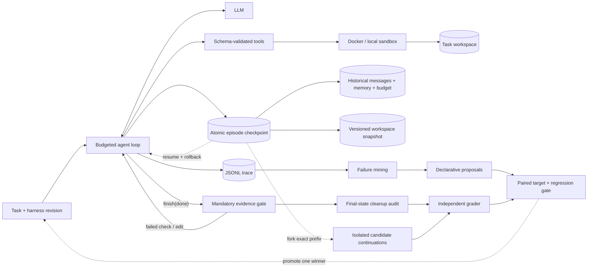
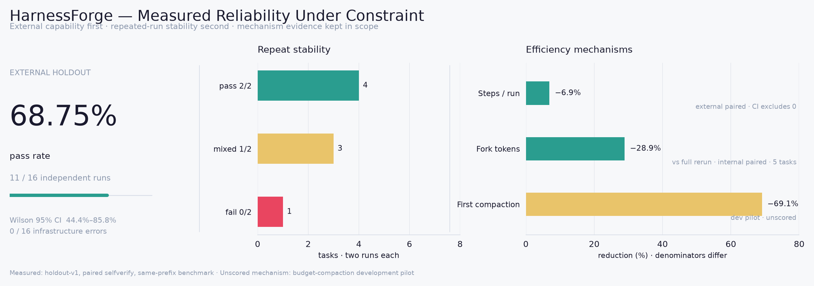
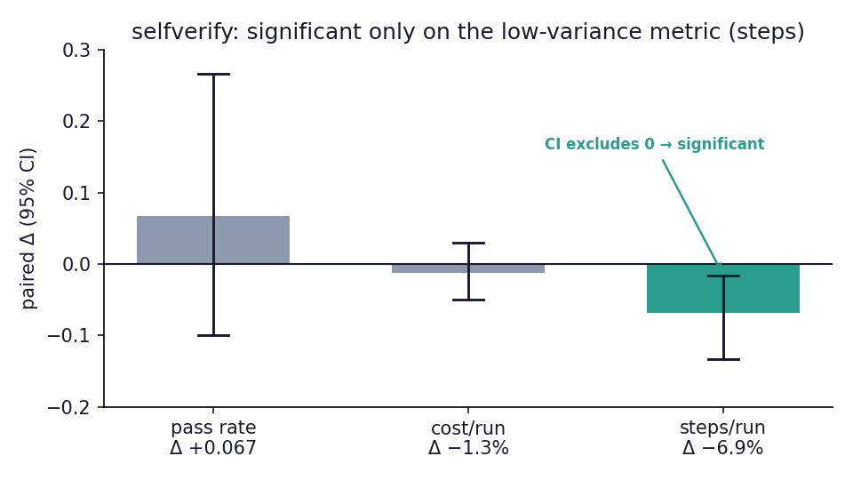
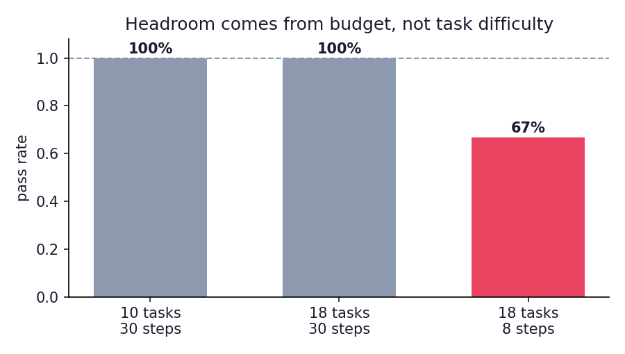

# HarnessForge

**An evidence-gated self-improving coding-agent harness.** HarnessForge runs
coding agents under explicit step/token/cost budgets, commits model and workspace
state at turn boundaries, resumes or forks exact prefixes, and measures harness
changes behind an independent regression gate.

Built to practice [harness engineering](https://martinfowler.com/articles/harness-engineering.html):
making non-deterministic agent systems reliable through constraints, observability,
recovery, and feedback loops — not prompt tricks.


---

## What is built

- **Durable episodes:** atomic checkpoints contain messages, memory, termination
  guards, and the token/cost ledger; versioned workspace snapshots support rollback.
- **Exact-prefix experiments:** any historical checkpoint can be forked into
  isolated candidate runs, optionally under a different harness revision.
- **Measured self-improvement:** trace mining proposes declarative harness changes;
  immutable sibling candidates face paired target/regression evaluation before one
  winner can be promoted.
- **Crash-safe autonomous search:** multi-round campaigns use isolated Harness
  revisions, persist a protocol-locked audit after every round, remember rejected
  candidates, and resume without silently repeating completed search rounds.
- **Budget-pressure control:** cumulative token pressure collapses complete old
  tool-use/result turns into a bounded deterministic ledger while recent evidence
  stays verbatim, preventing a moderate context from bankrupting a long episode.
- **Auditable execution:** JSONL traces, replay, independent graders, provenance-rich
  manifests, truthful tool errors, fail-fast permanent API failures, and partial
  token/cost accounting even when an infrastructure failure aborts a task.

| Evidence | Observed result | Scope |
|---|---:|---|
| Terminal-Bench 2.0 holdout-v1 | **11/16 = 68.75%**, CI [44.4%, 85.8%] | 8 metadata-pinned unseen tasks × 2; Sonnet 5 + verifier; 0 infra errors |
| Terminal-Bench 2.0 development subset | **19/40 = 47.5%**, CI [32.9%, 62.5%] | 20 pinned tasks × 2; Haiku 4.5 baseline; 0 infra errors |
| Self-Harness search | **3 rounds / 6 candidate gates** | completed with 2 automatic transitions; 1 promotion, 5 rejections, 0 manual interventions |
| selfverify intervention | **−6.9% steps**, 95% CI [−13.3%, −1.6%] | paired aggregate experiment |
| same-prefix candidate screening | **−28.9% tokens/cost**, paired CI excludes 0 | 5-task mechanism benchmark |
| controlled process crash | **2,845 paid tokens restored**, grader 2/2 | one-task recovery drill |

The last two rows are explicitly mechanism checks, not population-level quality
estimates. See [EXPERIMENTS.md](EXPERIMENTS.md) for statistical and tooling caveats.
The denominator-checked four-axis view is in [BENCHMARK.md](BENCHMARK.md); its
[machine-readable scorecard](docs/data/benchmark_scorecard.json) is reproduced by a
golden test rather than maintained as an unverified marketing table.
For domestic recruiting and interview wording, start with the
[Chinese application and interview brief](docs/PROJECT_BRIEF_ZH.md); the longer
[Chinese benchmark brief](docs/BENCHMARK_ZH.md) separates measured results,
mechanism telemetry, and the unscored forecast.
The dedicated [Self-Harness evidence card](docs/SELF_HARNESS_EVIDENCE.md) separates
closed-loop execution, confirmed efficiency improvement, unattended campaign evidence,
and the still-unconfirmed causal Pass Rate claim.

## Architecture


```mermaid
flowchart LR
    I["Task + harness revision"] --> L["Budgeted agent loop"]
    L <--> M["LLM"]
    L --> V["Schema-validated tools"]
    V --> S["Docker / local sandbox"]
    S --> W[("Task workspace")]

    L --> C[("Atomic episode checkpoint")]
    C --> H[("Historical messages + memory + budget")]
    C --> P[("Versioned workspace snapshot")]
    C -.->|resume + rollback| L
    C -.->|fork exact prefix| F["Isolated candidate continuations"]

    L --> T[("JSONL trace")]
    L -->|"finish(done)"| R["Mandatory evidence gate"]
    R -->|"failed check / edit"| L
    R --> A["Final-state cleanup audit"]
    A --> G
    F --> G["Independent grader"]
    T --> N["Failure mining"]
    N --> Q["Declarative proposals"]
    Q --> E["Paired target + regression gate"]
    G --> E
    E -.->|promote one winner| I
```

The critical invariant is that a checkpoint becomes resumable only after its
workspace snapshot and state ledger are committed. Forks copy that immutable state;
ordinary resume rejects prompt or harness drift. Detailed failure boundaries and
commit sequence: [Architecture notes](docs/ARCHITECTURE.md).

---

## Results at a glance

**Terminal-Bench 2.0 holdout-v1.** Eight tasks were pinned from metadata only and kept
disjoint from the 20-task development subset; their instructions, solutions, and tests
were not inspected before the protocol was frozen. Each ran twice in its real Docker
image against TB's own reward check. Agent: `claude-sonnet-5`; 40-step, 500k cumulative
token, 16k output-token/call, and $2/task caps.

| | Pass rate | Notes |
|---|---|---|
| Mandatory verifier holdout | **68.75%** (11/16), CI **[44.4%, 85.8%]** | 0 infra errors; $18.96 total; first repeat 7/8, second 4/8 |
| Haiku development baseline | **47.5%** (19/40) | Different model/tasks/budget; diagnostic baseline, not a causal comparison |

The verifier is a runtime state machine, not just a prompt. The first `finish(done)`
starts an adversarial review; successful bash evidence is mandatory, edits or failed
checks reset that evidence, and a separate final-state audit removes binaries, logs,
caches, and processes created only by testing. All verifier state is checkpointed, so
crash recovery cannot bypass the gate. Four tasks passed 2/2, three passed 1/2, and one
failed 0/2. The 87.5% first repeat versus 50% second repeat is why the reported number
uses all 16 runs rather than selecting the better sample.

Machine-readable result: [`docs/data/tb_holdout_v1_verifier_scorecard.json`](docs/data/tb_holdout_v1_verifier_scorecard.json),
regenerated by `python -m harnessforge.eval.holdout_scorecard ...` with protocol and
denominator validation. This is an 8-task holdout result, **not** an official 89-task
Terminal-Bench leaderboard submission.

API credit was unavailable for the separately frozen holdout-v2, so it remains
explicitly **unscored**. An offline Jeffreys-prior Beta-Binomial forecast based only on
v1 has median 11/16 and a wide 95% predictive interval of 5–15; it is planning
evidence, not a measured score. The generator and forbidden-claim checks live in
[`docs/data/tb_holdout_v2_forecast.json`](docs/data/tb_holdout_v2_forecast.json).



**The headline isn't a number — it's a method.** Every proposed harness change is
measured, and the ones that turn out to be noise are rejected, including changes an
earlier, weaker gate had already accepted. The intervention arc:

| Intervention (increasingly well-designed) | Looked like | Held up under rigorous measurement? |
|---|---|---|
| *native round 1:* "reverify immediately after each patch" | small-sample validation: **+100%** on targeted tasks | ❌ controlled A/B: **≈0** — was noise the gate merged |
| *TB finish-fix:* "finish when you judge the task done" | −19% cost, agent stops on its own | ❌ pass rate **−0.10, CI [−0.30, +0.10]** — the removed gate was load-bearing |
| *TB selfverify:* "verify each deliverable before finishing" | targets +0.095 pass rate (CI crosses 0); **−6.9% steps** | ✅ on the right metric: **steps −6.9%, 95% CI [−13.3%, −1.6%]** (excludes 0) at no pass-rate cost |
| *TB mandatory verifier:* runtime evidence gate + final-state audit | first holdout repeat **87.5%** | ✅ all frozen repeats **68.75% (11/16)**; 0 infra errors — no best-sample selection |

The arc is the result: each intervention was better designed than the last, and each was
measured more rigorously (single-run → paired → high-signal selection + pooled bootstrap →
continuous-metric comparison → disjoint repeated holdout). The selfverify row shows why a
pass-rate lift of a few points needs ~16× the data to confirm, while its efficiency gain is **statistically
significant on the same runs** because steps is a continuous, low-variance metric.
**Picking the higher-power metric is the result.** The takeaway isn't a prompt — reliable
self-improvement needs a *measurement regime* (effect-size thresholds, regression guards,
the right metric) more than a cleverer change.



Full write-up: [EXPERIMENTS.md](EXPERIMENTS.md). Full visual evidence set:
[industrial chart suite](docs/figures/industrial/README.md).

---

## Why these design choices

**Headroom via budget, not a weak model.** Modern small models already solve
self-contained tasks: `claude-haiku-4-5` passed a 54-run native suite at 100%. Real
harness work isn't babysitting a dumb model — it's maximizing a strong model's
reliability under latency/step/cost constraints. So the agent is deliberately
constrained (tight step budget; a hard external benchmark) to push it into the regime
where *the harness* — not model capability — decides success.



**Declarative-only evolution (v1).** The harness is split into evolvable components
(`system_prompt.md`, `tool_descriptions.yaml`, `loop_policy.yaml`) and fixed runtime
code. Self-harness proposes small diffs to the declarative components only —
LLM-generated diffs to executable code fail as runtime crashes the pass-rate gate
can't catch.

**Statistical power is a first-class constraint.** Borderline tasks have true pass
rates around 0.3–0.7; at 2–3 repeats, per-task results flip freely. The validation
gate uses paired before/after repeats and an effect-size threshold, and every reported
number carries a bootstrap or Wilson interval.

---

## How it works

The **agent loop** (`src/harnessforge/agent/loop.py`) is a from-scratch plan → tool-call
→ observation loop with retries, termination heuristics, context compaction, and a
budget guard. Its budget-pressure controller removes complete old tool protocol pairs,
retains six recent turns, and carries a bounded action/result ledger in the original
task message; this preserves Anthropic tool-use validity while reducing repeated input.
Tools: `bash`, `read_file`, `write_file`, `apply_patch`, `memory_write`, `finish`, run in
a **Docker sandbox** (or a local sandbox for tests). Every step is a **JSONL trace event**
with tokens, cost, and exit reason — mining, replay, and reporting all read that schema.

---

## Layout

```
harness/                 evolvable components (the "genome")
src/harnessforge/
  agent/       loop, LLM client, tools, context compaction, task memory, arg validation
               + atomic episode checkpoints
  sandbox/     docker / local / terminal-bench sandboxes
  eval/        task format, runners, fork/recovery reports, select, stats, compare
  selfharness/ mining, proposal (multi-candidate), search (memory), validation, round/campaign
  replay.py    step-by-step trace replay CLI
  trace.py     JSONL trace schema + writer
tasks/                   18 native tasks (bidirectionally verified)
scripts/                 figure generation, TB image pre-pull
docs/                    figures, data snapshots, dashboard
  ARCHITECTURE.md        checkpoint, recovery, fork, and promotion invariants
  PROJECT_BRIEF_ZH.md    Chinese resume and interview evidence card
  BENCHMARK_ZH.md        Chinese recruiter brief, resume bullets, and benchmark Q&A
  RESUME_BULLETS.md      evidence-backed portfolio wording
EXPERIMENTS.md           full experiment log + calibration table
```

## Tooling

```bash
make report                    # lint + full test suite + regenerate figures
python -m harnessforge.replay runs/tb_baseline/traces/<run>.jsonl   # step-by-step trace replay
make replay-fails RUN=runs/tb_baseline                             # replay every budget-exhausted run
python -m harnessforge.eval.compare --control A --treatment B      # paired pass-rate + efficiency CIs
python -m harnessforge.eval.benchmark_scorecard                    # regenerate the four-axis evidence card
python -m harnessforge.eval.recovery_report runs/experiment        # checkpoint/fork metrics

# fork step 3 into an isolated candidate run, optionally under a new harness
python -m harnessforge.eval.fork --source-run runs/control \
    --target-run runs/candidate --task-id t01_fix_off_by_one \
    --step 3 --harness-dir harness_candidate

# run several harnesses from that exact checkpoint and rank continuations
python -m harnessforge.eval.counterfactual \
    --source-run runs/control --out runs/counterfactual \
    --task-id t01_fix_off_by_one --step 3 \
    --candidate baseline=harness \
    --candidate selfverify=harness_variants/selfverify_v1
# add --include-full-rerun only when you intend the extra API spend

# aggregate the same protocol across tasks; each completed arm is resumable
python -m harnessforge.eval.multitask_counterfactual \
    --source-run runs/source --out runs/multitask-counterfactual \
    --task-ids t01_fix_off_by_one t05_fix_regex t09_fix_infinite_loop \
    --candidate baseline=harness --checkpoint-fraction 0.5 --sandbox local \
    --include-full-rerun --max-new-cost-usd 0.30

# controlled process-exit drill (single native task/repeat, concurrency=1)
python -m harnessforge.eval.runner --tasks tasks --out runs/chaos \
    --task-ids t01_fix_off_by_one --concurrency 1 --sandbox local \
    --fault-exit-after-checkpoint 2
python -m harnessforge.eval.runner --tasks tasks --out runs/chaos \
    --task-ids t01_fix_off_by_one --concurrency 1 --sandbox local --resume
```

**Live multi-task same-prefix benchmark (mechanism/cost evidence, not a quality
claim).** Five baseline trajectories were checkpointed under an 8-step budget. A
declared rule selected step 4—the first non-terminal checkpoint at or beyond 50%
of each trajectory's last eligible step—before any continuation outcome was seen.
Each prefix then produced one fork continuation and one independent full-rerun
control. Forks used **74,662 tokens / $0.091406** versus **104,969 / $0.128533**:
**30,307 fewer tokens (28.9%) and $0.037127 less (28.9%)**. The paired per-task
continuation-minus-full token interval was **[−8,263, −3,921]**, excluding zero.

Grader outcomes agreed on only **3/5** tasks, which is an equally important result:
same-prefix forks make candidate screening cheaper and better controlled, but do
not replace full repeated evaluation. End-to-end accounting includes the $0.143021
source run as well as both evaluation arms ($0.362960 total). Auditable,
path-sanitized evidence:
[`docs/data/durable_counterfactual_multitask.json`](docs/data/durable_counterfactual_multitask.json).

**Earlier one-task diagnostic pilot.** On `t17_fix_csv_parser`, two candidates forked from the same step-5
checkpoint used 29,140 continuation tokens versus 38,578 tokens for two independent
full reruns: **9,438 fewer tokens (24.5%) and $0.01055 less (23.6%)**. One fork
produced a grader-passing workspace while both full reruns failed, so outcome
agreement was only 1/2 — direct evidence that fork evaluation is cheaper but does
not replace repeated trials. The pilot also exposed two fixed-runtime defects
(plain-path unified diffs were rejected and `/workspace` replacement corrupted
already-expanded host paths); after the fixes, a baseline fork independently
produced a 4/4-passing workspace. See the auditable snapshot in
[`docs/data/durable_counterfactual_t17.json`](docs/data/durable_counterfactual_t17.json)
and the caveats in [EXPERIMENTS.md](EXPERIMENTS.md).

**Live crash/recovery drill.** A real `claude-haiku-4-5` run was deliberately
terminated with process exit code 86 immediately after checkpoint 2, then resumed
from the same run directory. It preserved **2,845 already-paid tokens / $0.003621**,
continued without a second `run_start`, applied the fix, called `finish`, and passed
the independent grader (2/2). The completed checkpoint and final result agree on
all 15,651 tokens / $0.019379; checkpoint-write p95 was **6.304 ms** over eight
commits. This is a one-run recovery mechanism check, not a latency SLO. Evidence:
[`docs/data/durable_recovery_t01.json`](docs/data/durable_recovery_t01.json).

The self-harness loop is a real search, not a single shot: it generates several
candidate diffs per failure pattern, materializes every sibling from the same immutable
parent harness, promotes only the best per pattern, and remembers rejected attempts
across rounds so they aren't re-proposed (`selfharness/search.py`,
`--rounds N` for a multi-round campaign). Campaigns execute on isolated revisions and
atomically persist `running` / `interrupted` / `completed` evidence after each round;
`--resume` verifies the frozen protocol and recovers a fully committed round without
repeating its model calls. Agent traces and miner/proposer calls feed separate durable
usage ledgers, then roll up into an exact campaign total. `--max-campaign-cost-usd`
adds a stage-boundary spend ceiling and a `budget_exhausted` state that can be resumed
with a higher ceiling. A strict final-comparison wrapper rejects protocol drift
before allowing the claim card to mark a Pass Rate uplift as causal. Current evidence
confirms a 6.94% step-efficiency gain, not an overall Pass Rate uplift.

## Quickstart

```bash
pip install -e ".[dev]"
make demo                       # offline evidence tour; no API key, network, or Docker
make test                       # mock-LLM end-to-end tests, no API cost

cp .env.example .env            # only needed for new live-model runs

# native suite
python -m harnessforge.eval.runner --tasks tasks --out runs/baseline --repeats 3 --sandbox local

# Terminal-Bench subset (needs Docker; pre-pull images first)
python scripts/prepull_tb_images.py --tb-root ~/terminal-bench-2
python -m harnessforge.eval.tb_runner --tb-root ~/terminal-bench-2 --out runs/tb_baseline --repeats 2
# add --expected-tb-revision <git-sha> to refuse benchmark drift

# aggregate sharded/repeated holdout runs; refuses mixed protocols or denominators
python -m harnessforge.eval.holdout_scorecard runs/holdout_a runs/holdout_b --out runs/scorecard.json

# one self-harness iteration
python -m harnessforge.selfharness.round --tasks tasks --out runs/round1 \
    --regression-tasks t01_fix_off_by_one t05_fix_regex --repeats 3

# audited autonomous campaign; add --resume after an infrastructure interruption
python -m harnessforge.selfharness.round --tasks tasks --out runs/campaign-v2 \
    --regression-tasks t01_fix_off_by_one t05_fix_regex t09_fix_infinite_loop \
    --rounds 3 --repeats 3 --max-campaign-cost-usd 20

# after matched round-0/final holdout runs, audit protocol equality + causal interval
python -m harnessforge.selfharness.proof \
    --control runs/final-ab/control-r1 runs/final-ab/control-r2 \
    --treatment runs/final-ab/treatment-r1 runs/final-ab/treatment-r2 \
    --minimum-tasks 20 --minimum-repeats 2 \
    --out runs/final-ab/causal_proof.json

# regenerate the machine-checked Self-Harness claim card
python -m harnessforge.selfharness.evidence \
    --campaign-report runs/campaign-v2/campaign_report.json \
    --causal-proof runs/final-ab/causal_proof.json
```

Before tagging a release, run `make release-check`; the same offline demo is also a
required CI step. See [RELEASE_CHECKLIST.md](RELEASE_CHECKLIST.md).

## Task memory

Context compaction keeps runs under budget by truncating old tool results — which
silently destroys information the agent may still need. The fix is durable storage
*outside* the message history (`agent/memory.py`): the agent calls `memory_write` to
save keyed notes (root cause, file paths, its plan), and the rendered notes ride on
the system prompt every turn, so compaction cannot touch them by construction. Notes
are bounded (`memory.max_notes`, `memory.max_chars_per_note` in `loop_policy.yaml`,
tunable by the self-harness loop) with FIFO eviction, every write is a `memory_write`
trace event visible in replay, and the end-to-end test proves the core claim: a note
written before compaction is still in the system prompt the model receives after it.

Memory is deliberately **episode-scoped**. Cross-task persistent memory stays out of
scope for v1: the benchmark is self-contained tasks, so a persistent store would add
machinery with no measurable benefit — same reasoning that kept code-graph tooling out.

## Error handling & recovery

The boundary between a toy and a production harness is what happens off the happy
path. What's handled here:

- **Malformed tool arguments** are validated against each tool's JSON Schema *before*
  execution (`agent/validation.py`); a bad call is rejected with a precise repair
  message ("missing required field `command`") instead of crashing inside the tool,
  and the agent recovers on the next turn. Repeated malformed calls abort with
  `repeated_validation_error`.
- **Malformed structured output (meta layer)**: when the miner/proposer must emit a
  JSON array and doesn't, the harness replies with the model's own output plus the
  exact parse/validation error and retries once (`selfharness/structured.py`); on the
  final attempt, valid items are salvaged instead of dropping the whole batch. Item-level
  schema failures (pydantic) get the same repair loop, not just unparseable JSON.
- **Tool timeouts**: every sandbox command runs under a wall-clock timeout (exit 124).
- **Transient API failures**: explicit client timeout + our own retry loop with
  exponential backoff and jitter. Only connection/timeout, 408/409/429, and 5xx
  failures retry; permanent 4xx errors (bad request, authentication, missing model,
  exhausted credits) fail after one call and skip the runner's whole-task retry.
- **Infra vs agent failures kept separate**: a network/sandbox failure retries the
  whole task once, then records an explicit `api_error`/`infra_error` outcome that is
  excluded from pass-rate — so infrastructure noise never masquerades as agent ability.
- **Crash-safe suite runs + resume**: every outcome is appended to `results.jsonl`
  the moment it exists (`eval/persistence.py`), so a mid-suite crash no longer
  discards completed API spend; `--resume` re-runs only missing (task, repeat) pairs
  and infra failures, and *refuses* to resume under a different harness version —
  mixed-version results files would corrupt provenance.
- **Durable, forkable native episodes**: each committed agent turn atomically
  checkpoints messages, task memory, termination guards, budget ledger, and a
  versioned workspace snapshot. Resume first rolls the filesystem back to that
  snapshot, discarding uncommitted mid-tool mutations, then continues from the
  saved model-call index. A completed `TaskResult` also prevents duplicate model
  spend if the process dies before `results.jsonl` is updated. Historical
  checkpoints can be forked into isolated run directories and rebound to a new
  harness revision for same-prefix counterfactual experiments; prefix tokens/cost
  remain in the budget ledger. `eval.counterfactual` runs several candidates from
  that identical state, separates logical total usage from actual continuation
  spend, ranks candidates, and can optionally add full-rerun controls to measure
  savings and outcome agreement. Harness or prompt drift is rejected on ordinary
  resume. Terminal-Bench container snapshots and exactly-once external side effects
  remain follow-up work and are not claimed here.
- **Controlled recovery drills**: the native runner can explicitly exit with code
  86 after a selected committed checkpoint. The option is default-off and refuses
  multi-task/repeat or concurrent runs, so it can exercise real process recovery
  without accidentally multiplying API work.
- **Reproducible run provenance**: manifests record source Git revision/dirty state,
  task-definition content hash, provider sampling configuration, pricing-table
  revision, and (for Terminal-Bench) its upstream revision plus declared Docker
  images. `--expected-tb-revision` can hard-fail on benchmark drift.
- **Budget guards**: hard caps on steps, tokens, and cost; loop-level termination on
  repeated identical actions or repeated errors.
- **Mandatory completion verification (opt-in)**: a checkpointed state machine defers
  the first completion claim, requires post-edit successful-command evidence, resets
  evidence on failed checks or mutations, and performs a separate final-state cleanup
  audit. Reasoning-capable models can use a configurable per-call output-token envelope
  so they do not repeatedly exhaust 4096 tokens before emitting a tool call.
- **Sandbox constraints**: per-task Docker isolation (no network for native tasks,
  memory/CPU limits); harness self-edits are backed up to `_history/` and git.

Six of these were added *because a real run hit them* (see EXPERIMENTS.md): a
retry loop with no timeout hung 27 min on a retired model ID; one task's API error
crashed the whole suite via `asyncio.gather`; flaky networks needed jittered backoff;
an exhausted-credit 400 exposed that permanent client errors were being retried;
and the live fork pilot exposed misleading patch errors plus unsafe local
`/workspace` rewriting.

**Deliberately out of scope (v1):** cross-task persistent memory (episode-scoped
memory is in — see Task memory above), semantic tool
routing, Terminal-Bench container snapshots, exactly-once external side effects,
and multi-agent evaluation. This is a
research harness focused on *evaluation and self-improvement*, not a full production
runtime — those walls are noted, not faked. See the harness-maturity self-assessment
in [EXPERIMENTS.md](EXPERIMENTS.md).

*Terminal-Bench is © Laude Institute, Apache-2.0. This project vendors none of it; the
adapter reads a local clone.*
