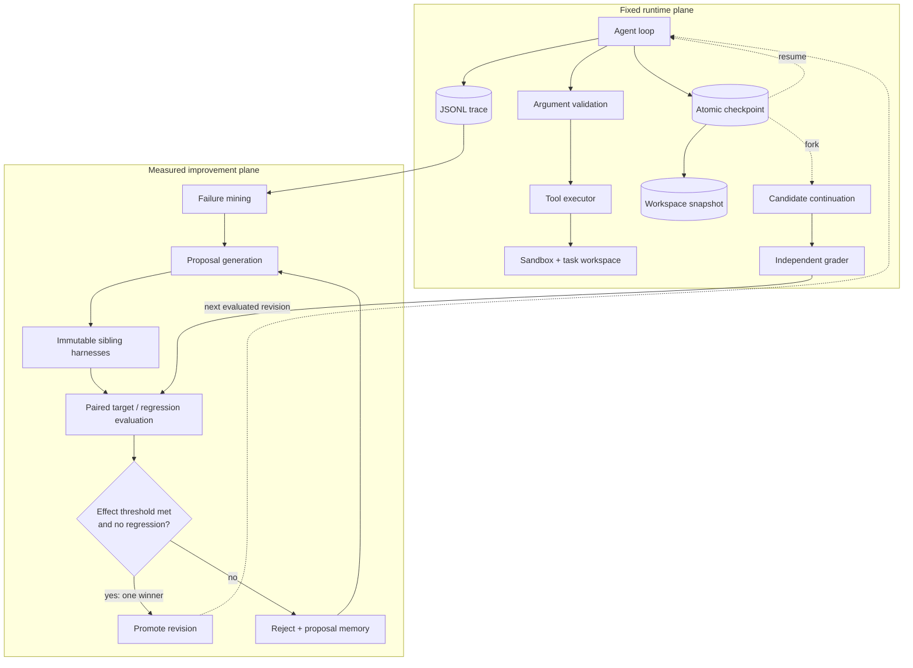
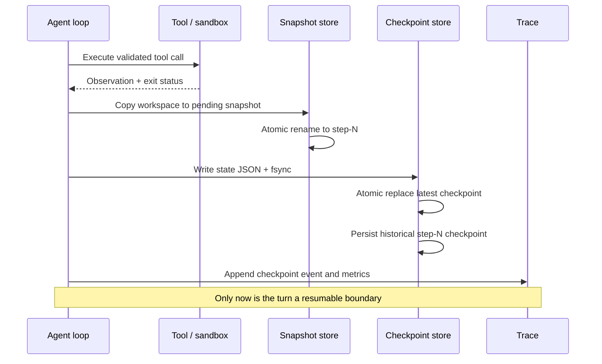

# HarnessForge architecture

HarnessForge separates two concerns that are often mixed together:

1. a fixed runtime that must execute, recover, trace, and grade reliably;
2. declarative harness components that may evolve only through measurement.

## Runtime and improvement planes

Runtime code is not LLM-editable in v1. The evolvable surface is restricted to
`system_prompt.md`, `tool_descriptions.yaml`, and `loop_policy.yaml`; executable
changes go through normal code review and tests.

## Turn commit protocol

Checkpoint state includes:

- next model-call index and full message sequence;
- episode memory and termination guards;
- test-run state;
- cumulative input/output tokens and USD cost;
- harness and task-prompt fingerprints;
- the committed workspace snapshot name;
- optional parent-run metadata and final result.

## Recovery contract

On ordinary `--resume`:

1. verify checkpoint schema, harness revision, and task-prompt fingerprint;
2. restore the workspace from the referenced snapshot, removing uncommitted
   mid-tool mutations;
3. restore messages, memory, guards, and the cumulative budget ledger;
4. append one `resume` trace event and continue at `next_step`;
5. if `final_result` is already committed, return it without another model call.

The controlled fault mode exits the process with code 86 only after a selected
checkpoint and trace event are committed. It refuses multi-task, multi-repeat, or
concurrent execution. This gives recovery tests a real process boundary without
turning ordinary exceptions into an artificial success path.

## Fork contract

A fork copies a historical checkpoint and its exact workspace snapshot into a new
run directory. It:

- preserves prefix messages, memory, token count, and cost in the logical budget;
- clears only the completion marker;
- records parent run, checkpoint, and harness revision;
- may bind to a different target harness revision;
- never mutates the source run or a sibling candidate.

Counterfactual reports separate logical total usage from incremental post-fork API
spend. Optional full reruns quantify cost savings and outcome agreement rather than
assuming a fork is statistically interchangeable with a fresh trajectory.

The multi-task coordinator applies a declared checkpoint-selection rule before
running any candidate arm, persists an aggregate report after every completed task,
and can resume both partial agent episodes and completed arms. A soft USD cap is
checked between tasks. Its accounting keeps four quantities separate: source-run
cost, already-paid prefix value, new continuation spend, and optional full-control
spend. Wilson intervals cover binary outcomes; paired task bootstrap intervals cover
continuous token and cost deltas.

## Candidate promotion contract

Every proposal sibling is materialized from the same immutable parent harness.
Candidate evaluation happens in isolated directories. The live harness is changed
only once, after selecting the best accepted candidate per failure pattern; atomic
replacement prevents accepted-but-losing siblings from leaking into the promoted
revision.

## Explicit boundaries

- Native task workspaces are snapshot/resume capable; Terminal-Bench container
  filesystems are not yet captured.
- Filesystem rollback does not provide exactly-once semantics for external services.
- Local sandbox mode is for trusted tests and smoke runs; Docker provides the
  isolation boundary for native benchmark execution.
- Local command timeouts kill an isolated process group and await pipe cleanup, so
  descendant processes cannot survive a timed-out shell and hold the event loop open.
- Same-prefix pilots control pre-fork history but do not eliminate stochastic
  continuation variance or replace powered repeated evaluation.
